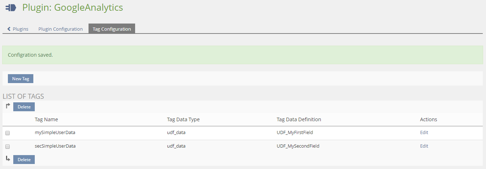
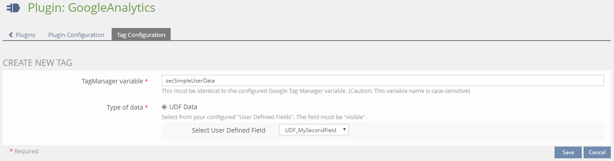
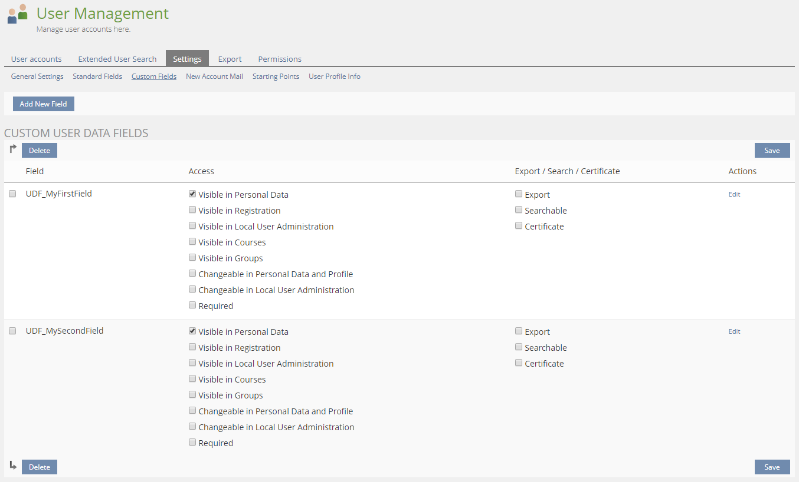
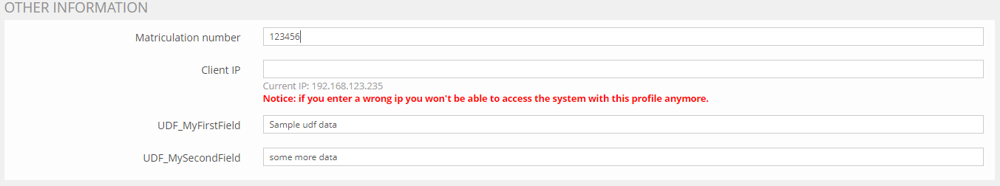

&nbsp;
 
Contact [Qualitus GmbH](mailto:info@qualitus.de) to get newer versions and updates.

# GoogleAnalytics

Simple Plugin to track statistics with GoogleAnalytics

## Requirements:
* ILIAS 5.3.0 - 5.4.999
* PHP 7.2+

## Installation

1. Clone from git or download and extract zip file
2. Rename folder to <b>GoogleAnalytics</b>
3. Copy folder to &lt;ilias root path&gt; /Customizing/global/plugins/Services/UIComponent/UserInterfaceHook/
4. Navigate in your ILIAS installation to <b>Administration -> Plugins</b> and execute
   * Actions/Update
   * Actions/Refresh Languages
   * Actions/Activate
   * Actions/Configuration

For more information please contact [LupusCoding](mailto:dittrich.ralph@lupuscoding.de)

## Custom Tag Configuration
### General

* Tag Configuration 
(*Administration => Plugins => GoogleAnalytics => Configure => Tag Configuration*) 

* New Tag form 

### UserDefinedFields (UDF)

To use UserDefinedFields as custom tags, just follow these steps:

1. Configure your UserDefinedFields 
(*Administration => User Management => Settings => Custom Fields*) 

2. Fill out the new fields at the user properties 

3. At the **Tag Configurations** "New Tag" form, select as **Type of data**
"UDF Data" and choose your UDF from the dropdown 
(*Administration => Plugins => GoogleAnalytics => Configure => Tag Configuration*) 

### Changelog
**version 1.1.0**
* Added Configuration for user defined fields as custom tags

**version 1.0.0**
* Build first release version

**version 0.1.0**
* Base support for GoogleTagManager and User ID tracking

